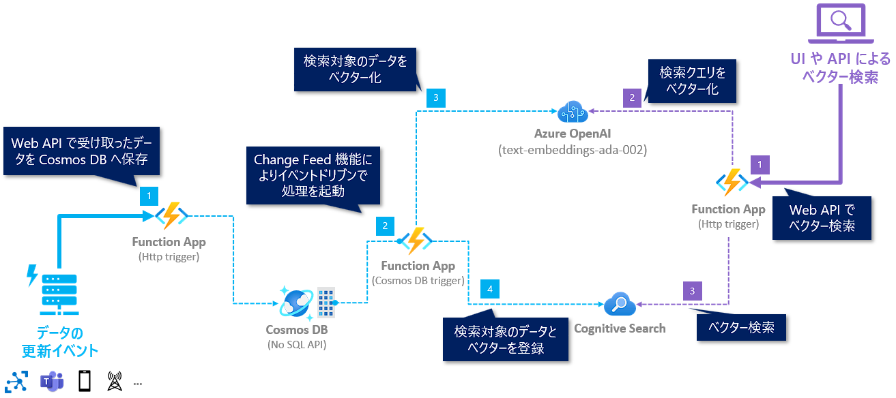

# TODO: title

## 💫 概要

このハンズオンでは、自社独自のデータを検索対象として Azure OpenAI Service でベクター検索を行なうための基礎として以下の実装を学びます。

- 自社独自のデータの更新をトリガーに、リアルタイムでベクター検索が可能な検索インデックスの更新
- ベクター検索

 

## アーキテクチャ

ハンズオンで実現するアーキテクチャのイメージは以下となります。

### 検索インデックスの更新 (水色の線)

- Web API (Function App - HTTP trigger) で受け取ったデータ更新を Cosmos DB に保存します (①)。
- Cosmos DB でデータ更新されると、Function App (Cosmos DB Trigger) をトリガーされます (②)。
- Function App (Cosmos DB Trigger) の処理で以下を行ないます。
  - ベクター検索の対象データを Azure OpenAI Service でベクター化します (③)。
  - Cognitive Search のインデックスを更新します (④)。

### ベクター検索 (紫色の線)

- Web API の Function App (Http trigger) で検索のクエリを受け取ります (①)。
- Function App (Http trigger) の処理で以下を行ないます。
  - 検索クエリを Azure OpenAI Service でベクター化します (②)。
  - Cognitive Search のインデックスに対してベクター検索を行ない (③) 、Web API の結果として返します。

 

## Azure のリソース作成時の注意

**※ 今回のハンズオンでは、Auzre のリソースを作成することで料金が発生するリソースもあります。ご自身の状況に応じて、今回のハンズオンの最後にリソースグループごとすべて消すなどは自己責任で行なってください。**

 

## ハンズオンの構成

0-3 のチャプターで今回利用する Azure のリソースを作成し、以降で実装を進めていきます。

タイトル | 概要
--- | ---
[🧪 0. Azure OpenAI Service のセットアップ](./docs/setup-cognitive-search.md) | 今回のハンズオンで利用する Azure OpenAI Service のリソースをセットアップします。
[🧪 1. Cognitive Search のセットアップ](./docs/setup-cognitive-search.md) | 今回のハンズオンで利用する Cognitive Search のリソースをセットアップします。
[🧪 2. Cosmos DB のセットアップ](./docs/setup-cosmos-db.md) | 今回のハンズオンで利用する Cosmos DB のリソースをセットアップします。
[🧪 3. Function App のセットアップ](./docs/setup-function-app.md) | 今回のハンズオンで利用する Function App のリソースをセットアップします。
[🧪 4. インデックスの更新処理の実装](./docs/implement-change-feed-dotnet.md) | Function App で、Change Feed 機能を活用して Cognitive Search のインデックスのデータを更新する処理を実装します。
[🧪 5. ベクター検索の実装](./docs/implement-vector-search.md) | Function App で、ベクター検索の API を実装します。
[(オプション)  🧪 6. Cosmos DB のデータ更新](./docs/Implement-cosmos-db-operations.md) | Function App で、Cosmos DB のデータを更新する処理を実装します。
[🚮 Azure のリソース削除](./docs/remove-azure-resources.md) | Azure のリソースを削除する方法を説明します。

 

## 🛠️ 事前準備

TODO:

## 🧑‍💻 Let's Get Started

以下のリンクからハンズオンの旅に出発しょう🚀

- [🧪 0. Azure OpenAI Service のセットアップ](./docs/setup-azure-openai.md)
