# 🧪 4. インデックスの更新処理の実装 (C#)

ここでは、アーキテクチャ図のインデックスの更新 (2～4) 部分の処理として、以下を実装します。

- Cosmos DB でデータ更新されると、Function App (Cosmos DB Trigger) をトリガーされます (②)。
- Function App (Cosmos DB Trigger) の処理で以下を行ないます。
  - ベクター検索の対象データを Azure OpenAI Service でベクター化します (③)。
  - Cognitive Search のインデックスを更新します (④)。


コンテンツは以下になります。

- 4-1. プロジェクトの作成
- 4-2. NuGet パッケージのセットアップ
- 4-3. Dependency Injection (DI) を構成
- 4-4. 機密情報の設定
- 4-5. Cognitive Search のインデックスの更新処理を実装
- 4-6. ローカルデバッグ
- 4-7. Azure へのデプロイ
- 4-8. 4-8. Azure での動作確認

エディターは Visual Studio 2022 を使った開発の説明をします。VS Code でも同様の開発は可能ですが手順が多少異なるため VS Code を利用する場合はご注意ください。

## 4-1. プロジェクトの作成

Visual Studio 2022 を起動して、"新しいプロジェクトの作成" をクリックします。

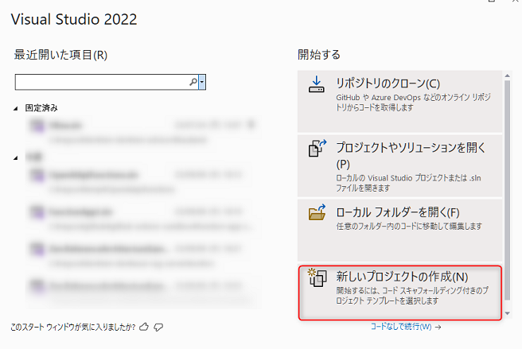

<br>

テンプレートの選択が表示されます。上部の検索で「functions」と入力し、"Azure Functions" をダブルクリックして次に進みます。

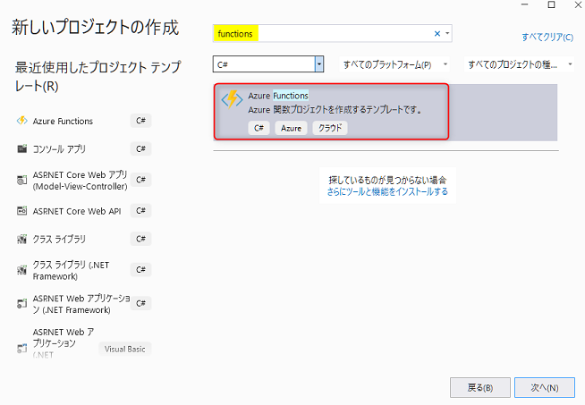

<br>


プロジェクトの構成が表示されます。以下を参考に入力し、"次へ" をクリックします。

 No. | 項目 | 入力内容
---: | --- | ---
1 | プロジェクト名 | 「Indexer」と入力します。
2 | 場所 | 任意のディレクトリを選択します。
3 | ソリューション名 | 「Handson202309」 を選択します。
4 | ソリューションとプロジェクトを同じディレクトリに配置する | チェックオフにします。

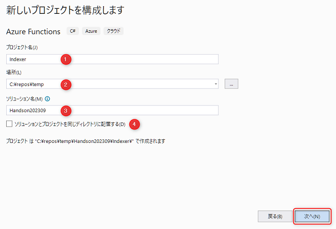

<br>

追加情報の入力です。以下を参考に入力し、"作成" をクリックすると、プロジェクトが作成されます。

No. | 項目 | 入力内容
---: | --- | ---
1 | Functions worker | ".NET6.0 (長期的なサポート)" を選択します。
2 | Function | "Cosmos DB Trigger" を選択します。その下のチェックは下図を参考にします。
3 | Collection name | 「azure」と入力します。これは Cosmos DB を作成したときに指定したコンテナー名です。
4 | Connection string setting name | 「CosmosConnection」と入力します。
5 | Database name | 「handson」と入力します。これは Cosmos DB を作成したときに指定したデータベース名です。その下にある "dependencies" を構成する"のチェックはオフにします。

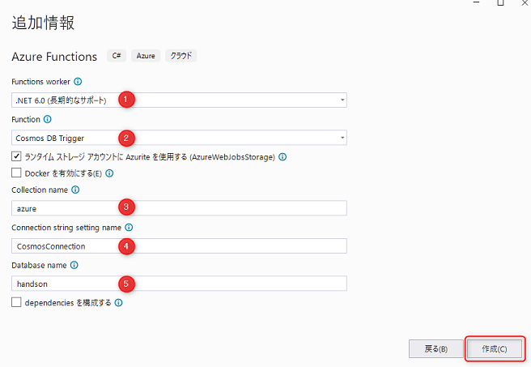

<br>


## 4-2. NuGet パッケージのセットアップ

実装に必要な NuGet パッケージの追加と更新を行います。

Visual Studio 2022 の上部にある検索で「nuget」と入力し、"NuGet パッケージの管理" をクリックします。

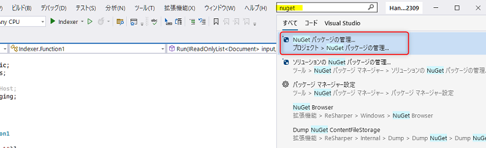

<br>

### パッケージのインストール

NuGet パッケージの管理画面が表示されます。最初に "プレリリースを含める" のチェックをオンにします。

次に、検索に以下のパッケージをインストールします。バージョンは基本的に最新のものを選択します。参考までに、2021年09月時点のバージョンを記載します。

- `Azure.AI.OpenAI` (v1.0.0-beta.7)
- `Azure.Search.Documents` (v11-5.0-beta.4)
- `Microsoft.Azure.Functions.Extensions` (v1.1.0)
- `Microsoft.Extensions.DependencyInjection` (v6.0.1)
  - 今回は .NET 6 を利用しているため v6 の最新バージョンを使います。

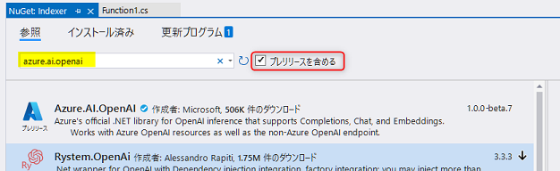

<br>

### パッケージの更新

"更新プログラム" のタブをクリックして "Microsoft.Azure.WebJobs.Extensions.CosmosDB" を最新にします (2021年09月時点では v4.3.1) 。

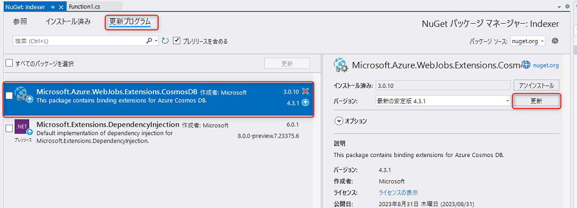

<br>

最終的にインストール済みのパッケージは以下の構成になります。

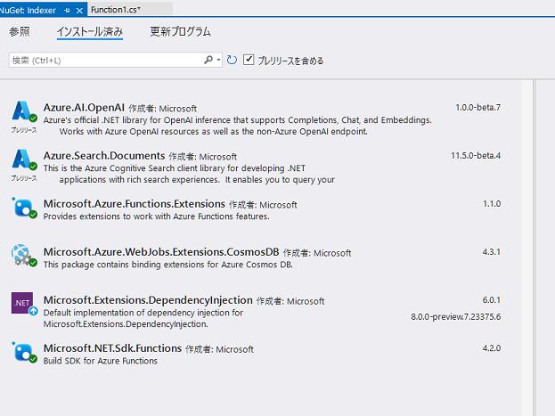

<br>


### コードの更新 1

これからいくつかのコードを更新します。順に説明しますが、このセクションの最後で更新後のコードを記載します。

最初に、`Microsoft.Azure.WebJobs.Extensions.CosmosDB` を v4 系に更新したことでエラーになっているコードに対応します。

ソリューションエクスプローラーで Function1 を開いて、14行目～17行目でエラーになっている文字を以下のように修正します。

行数 | 修正前 | 修修正
---: | --- | ---
15 | `collectionName` | `containerName`
16 | `ConnectionStringSetting` | `Connection`
17 | `LeaseCollectionName` | `LeaseContainerName`

### コードの更新 2

C# 10.0 から [File-scoped namespace](https://learn.microsoft.com/ja-jp/dotnet/csharp/language-reference/keywords/namespace) を適用してインデントを1つ減らすことができるようになりました。

8行目の最後に `;` を追加して `namespace Indexer;` にします。`namespace` の {} は削除します。

### コードの更新 3

ファイルの一番下の行に以下のコードを追加します。この record は、今回利用する[サンプルデータ](../data/sample-data.json)の JSON のスキーマであり、Cosmos DB に保存されるデータのスキーマでもあります。

```csharp
public record AzureInfo(string Id, string Category, string Title, string Content);
```

そしてエラーが残っている `Document` の部分を `AzureInfo` に修正します。

### コードの更新 4

上部にある using で、使っていない行を削除します。

### コードの更新 5

Cosmos DB の Change Feed では、状態を管理するコンテナーが必要になります。それを自動生成するプロパティを追加します。

CosmosDBTrigger のプロパティで以下を追加します。

```csharp
CreateLeaseContainerIfNotExists = true,
```

詳細は後続の「ここまでのコード」セクションを参照してください。

※ 今回は lease コンテナー作成の手間は簡略化のためにこの設定を追加しました。これで状態管理用のコンテナーがない場合は自動生成されますが、Function App が起動する度に存在チェックが実行されるため、ムダなオーバーヘッドになります。本番運用での利用はこの設定を使わないのがベストプラクティスです。


### 4-2 で更新したコード

4つの更新を行なったコードは以下のようになります。

```csharp
using Microsoft.Azure.WebJobs;
using Microsoft.Extensions.Logging;
using System.Collections.Generic;

namespace Indexer;

public static class Function1
{
    [FunctionName("Function1")]
    public static void Run([CosmosDBTrigger(
            databaseName: "handson",
            containerName: "azure",
            Connection = "CosmosConnection",
            CreateLeaseContainerIfNotExists = true,
            LeaseContainerName = "leases")]IReadOnlyList<AzureInfo> input,
        ILogger log)
    {
        if (input != null && input.Count > 0)
        {
            log.LogInformation("Documents modified " + input.Count);
            log.LogInformation("First document Id " + input[0].Id);
        }
    }
}

public record AzureInfo(string Id, string Category, string Title, string Content);
```


## 4-3. Dependency Injection (DI) を構成

Azure で Azure OpenAI や Cognitive Search へアクセスするためのクライアントライブラリは、ライフサイクルの管理が重要になります。その管理を行うために、DI の機能を使います。

ここでは、Cognitive Search のインデックスを更新するために、下2つの class を登録します。

- `OpenAIClient` (`Azure.AI.OpenAI` namespace) を Singleton で登録
- `SearchClient` (`Azure.Search.Documents` namespace) を Singleton で登録


ソリューションエクスプローラーで Function App ("Indexer") を右クリック (①) → "追加" (②) をクリック→ "クラス" (③) をクリックします。

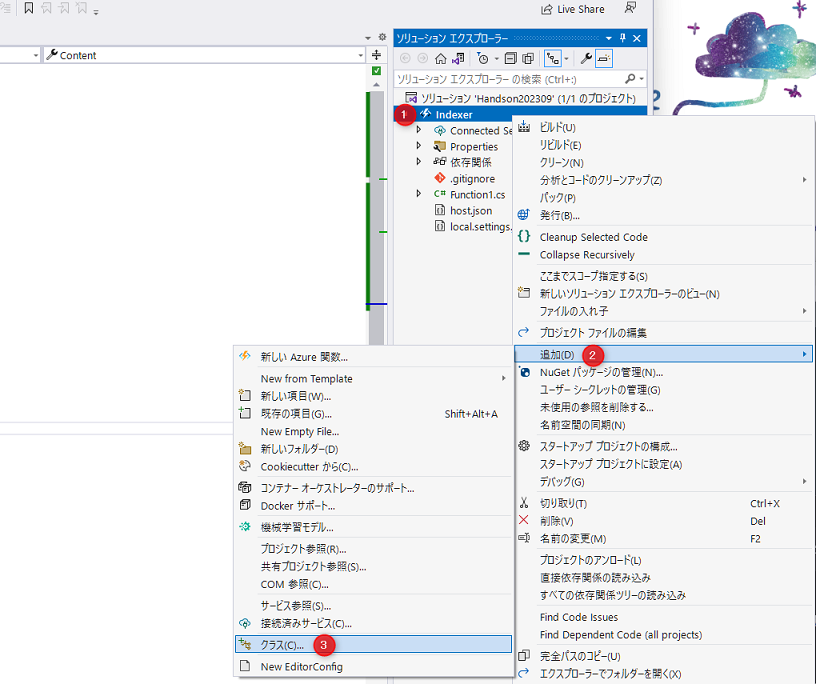

<br>

名前は「Startup.cs」と入力し、"追加" をクリックすると、ファイルが作成されます。


<br>


以下のようにコードを構成します。

```csharp
using Azure;
using Azure.AI.OpenAI;
using Azure.Core.Serialization;
using Azure.Search.Documents;
using Microsoft.Azure.Functions.Extensions.DependencyInjection;
using Microsoft.Extensions.DependencyInjection;
using System;
using System.Text.Json;

[assembly: FunctionsStartup(typeof(Indexer.Startup))]

namespace Indexer;

public class Startup : FunctionsStartup
{
    public override void Configure(IFunctionsHostBuilder builder)
    {
        // OpenAIClient を登録
        builder.Services.AddSingleton(_ =>
        {
            var endpoint = new Uri(Environment.GetEnvironmentVariable("AzureOpenAIOptions:Endpoint") ?? throw new NullReferenceException("AzureOpenAIOptions:Endpoint"));
            var apiKey = Environment.GetEnvironmentVariable("AzureOpenAIOptions:ApiKey") ?? throw new NullReferenceException("AzureOpenAIOptions:ApiKey");

            return new OpenAIClient(endpoint, new AzureKeyCredential(apiKey));
        });

        // SearchClient を登録
        builder.Services.AddSingleton(_ =>
        {
            var endpoint = new Uri(Environment.GetEnvironmentVariable("CognitiveSearchOptions:Endpoint") ?? throw new NullReferenceException("CognitiveSearchOptions:Endpoint"));
            var adminKey = Environment.GetEnvironmentVariable("CognitiveSearchOptions:AdminKey") ?? throw new NullReferenceException("CognitiveSearchOptions:AdminKey");
            var indexName = Environment.GetEnvironmentVariable("CognitiveSearchOptions:IndexName") ?? throw new NullReferenceException("CognitiveSearchOptions:IndexName");

            var jsonSerializerOptions = new JsonSerializerOptions { PropertyNamingPolicy = JsonNamingPolicy.CamelCase };
            // C# の class (pascal-case) と CognitiveSearch index schema (camel-case) を補完するためのオプション
            var searchClientOptions = new SearchClientOptions { Serializer = new JsonObjectSerializer(jsonSerializerOptions) };

            return new SearchClient(endpoint, indexName, new AzureKeyCredential(adminKey), searchClientOptions);
        });
    }
}
```

※ DI には `builder.Services.AddOpenAIClient()` や `AddSearchClient` といった便利な拡張メソッドもありますが、今回は使わずにコードを記述しています。

これで DI の設定は完了です。

## 4-4. 機密情報の設定

API キーや接続文字列といった機密情報は、一般的に GitHub などのソースコード管理をするリポジトリに含めません。また、環境によって変わる変数は、環境変数として設定します。  
Function App での機密情報の管理は、ソースコード管理に含まれない[ユーザーシークレット](https://learn.microsoft.com/ja-jp/aspnet/core/security/app-secrets) または [local.settings.json](https://learn.microsoft.com/ja-jp/azure/azure-functions/functions-develop-local#local-settings-file) で管理することが一般的です。

今回は、local.settings.json で管理します。local.settings.json はローカルでの開発時に利用するファイルで、Azure にデプロイ時には含まれません。

前述で DI を構成したときに、`Environment.GetEnvironmentVariable()` メソッドを使って環境変数から値を取得しています。これら値を local.settings.json で構成します。

ソリューションエクスプローラーから local.settings.json を開き、以下のように更新します。

```json
{
  "IsEncrypted": false,
  "Values": {
    "AzureWebJobsStorage": "UseDevelopmentStorage=true",
    "FUNCTIONS_WORKER_RUNTIME": "dotnet",
    "CosmosConnection": "",
    "AzureOpenAIOptions:Endpoint": "",
    "AzureOpenAIOptions:ApiKey": "",
    "CognitiveSearchOptions:Endpoint": "",
    "CognitiveSearchOptions:AdminKey": "",
    "CognitiveSearchOptions:IndexName": "azure"
  }
}
```

次にそれぞれの値を Azure portal から取得します。

### Azure OpenAI Service の情報

Azure OpenAI Studio (`https://oai.azure.com/`) を開き、上部の Settings のアイコンをクリック (①) → Resource をクリック (②) して Azure OpenAI のリソースの一覧を表示し、以下の操作をします。

- Endpoint の値をコピーして local.settings.json の `AzureOpenAIOptions:Endpoint` の値にペーストします。
- "Show key" をクリックして Key の表示させてから値をコピーして、local.settings.json の `AzureOpenAIOptions:ApiKey` の値にペーストします。

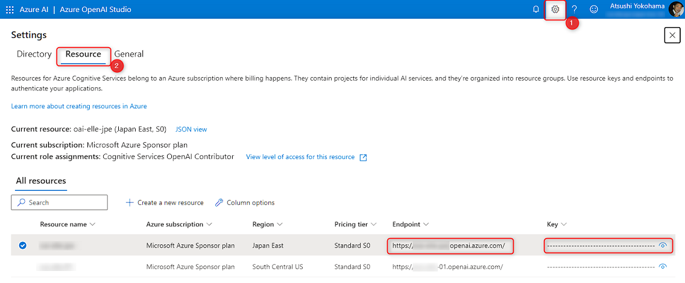


### Cosmos DB の情報

Azure portal で Cosmos DB のリソースを開き以下の操作をします。

- 左側のメニューから "キー" をクリック (①)
- プライマリ接続文字列の右側にある目のアイコンをクリック (②) して接続文字列を表示
- コピーボタンをクリック (③) して、接続文字列をコピー
- local.settings.json の `CosmosConnection` の値に接続文字列の値をペーストします。

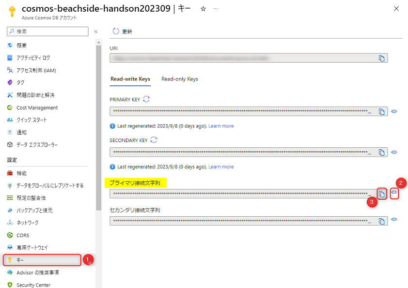

<br>

### Cognitive Search の情報

Azure portal で Cognitive Search のリソースを開き以下の操作をします。

- 左側のメニューから "概要" をクリック (①) して URL の値をコピー
- local.settings.json の `CognitiveSearchOptions:Endpoint` の値に URL の値をペーストします。

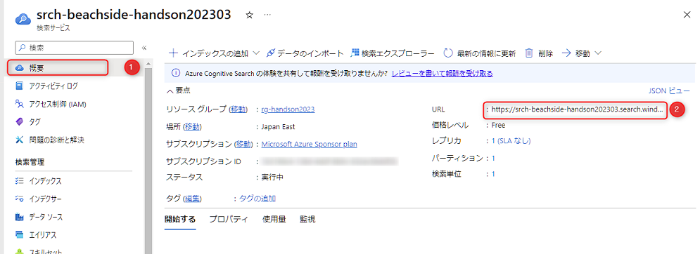

次に、左側のメニューから "キー" をクリック (①) して、プライマリ管理者キーをコピーして、local.settings.json の `CognitiveSearchOptions:AdminKey` の値にペーストします。


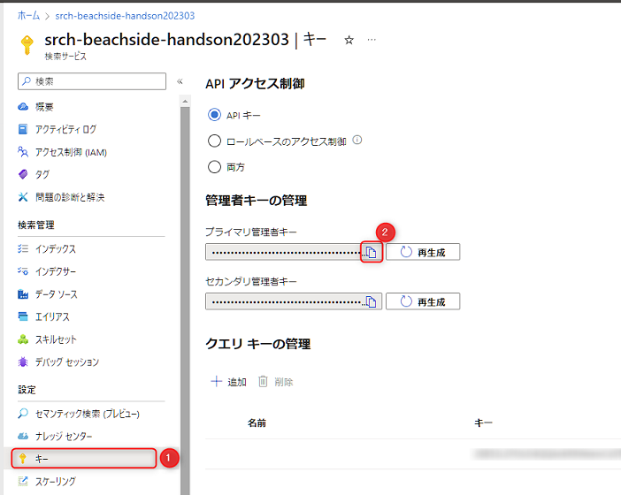

<br>

local.settings.json ですべての値が入力されたことを確認して、ファイルを保存したら設定完了です。

## 4-5. Cognitive Search のインデックスの更新処理を実装

ここから、Function1 の処理を実装します。

### コンストラクターインジェクション

まず、DI で構成した OpenAIClient と SearchClient をコンストラクターインジェクションで取得します。やることは以下です。

- class とメソッドの static を削除
- コンストラクターを作成して、`OpenAIClient` と `SearchClient` を受け取るよう構成
- 受け取った引数をフィールドに格納

Function1 のコードは以下のようになります。

```csharp
using Microsoft.Azure.WebJobs;
using Microsoft.Extensions.Logging;
using System.Collections.Generic;
using Azure.AI.OpenAI;
using Azure.Search.Documents;
using System.Threading.Tasks;

namespace Indexer;

public class Function1
{
    private readonly OpenAIClient _openAIClient;
    private readonly SearchClient _searchClient;

    public Function1(OpenAIClient openAIClient, SearchClient searchClient)
    {
        _openAIClient = openAIClient;
        _searchClient = searchClient;
    }

    [FunctionName("Function1")]
    public void Run([CosmosDBTrigger(
// 以下省略
```

### Cognitive Search のインデックスの更新

今回の[サンプルデータの json](../data/sample-data.json)は、Azure のサービスの説明で、スキーマは以下になっています。

- id: ドキュメントの ID 。
- title: サービスのタイトル。
- content: サービスの説明。この値を対象にベクター検索をできるように実装します。
- category: Azure のサービスのカテゴリー。

コードの実装の流れは以下です。

- class の最初で、変数 `EmbeddingsDeploymentName` に Azure OpenAI の "text-embedding-ada-002" をデプロイしたときの Deployment Name を設定します。
  - ここでは、チャプター1で指定した "text-embedding-ada-002" を設定しています。
- `Run` メソッドは、Change Feed が起動したタイミングで取得できる複数のデータが `input` に入ってきます。
- そのデータを1件ずつ処理します。
  - ベクター検索は、content を対象に行ないます。そのため、Azure OpenAI を使って content 値をベクター化します。
  - Cognitive Search のインデックスのスキーマである `IndexDocument` 型に変換します。
- 最後にまとめて Cognitive Serach のインデックスとして更新します。

※ 操作の簡略化のため `IndexDocument` class と `AzureInfo` record を Function1.cs の中に書いていますが、本番運用では別ファイルに切り出すのがベストプラクティスです。

```csharp
using Microsoft.Azure.WebJobs;
using Microsoft.Extensions.Logging;
using System.Collections.Generic;
using Azure.AI.OpenAI;
using Azure.Search.Documents;
using System.Threading.Tasks;

namespace Indexer;

public class Function1
{
    // Azure OpenAI のモデル: text-embedding-ada-002 の Deployment Name (Model Name ではないので注意)
    private const string EmbeddingsDeploymentName = "text-embedding-ada-002";

    private readonly OpenAIClient _openAIClient;
    private readonly SearchClient _searchClient;

    public Function1(OpenAIClient openAIClient, SearchClient searchClient)
    {
        _openAIClient = openAIClient;
        _searchClient = searchClient;
    }

    [FunctionName("Function1")]
    public async Task Run([CosmosDBTrigger(
            databaseName: "handson",
            containerName: "azure",
            Connection = "CosmosConnection",
            CreateLeaseContainerIfNotExists = true,
            LeaseContainerName = "leases")]IReadOnlyList<AzureInfo> input,
        ILogger log)
    {
        var documentsToUpload = new List<IndexDocument>();

        foreach (var azureInfo in input)
        {
            // content の値をベクター化
            var contentVector = await GetEmbeddingAsync(azureInfo.Content);

            // Cognitive Search のインデックスのスキーマへ変換
            documentsToUpload.Add(new IndexDocument
            {
                Id = azureInfo.Id,
                Category = azureInfo.Category,
                Title = azureInfo.Title,
                Content = azureInfo.Content,
                ContentVector = contentVector
            });
        }

        // Cognitive Search のインデックス更新
        await _searchClient.MergeOrUploadDocumentsAsync(documentsToUpload);
        log.LogInformation($"{documentsToUpload.Count} document(s) uploaded.");
    }

    private async Task<IReadOnlyList<float>> GetEmbeddingAsync(string text)
    {
        var response = await _openAIClient.GetEmbeddingsAsync(EmbeddingsDeploymentName, new EmbeddingsOptions(text));
        return response.Value.Data[0].Embedding;
    }
}

/// <summary>
/// Cosmos DB: azure コンテナーのスキーマ
/// </summary>
public record AzureInfo(string Id, string Category, string Title, string Content);

/// <summary>
/// Cognitive Search の Index 更新用スキーマ
/// </summary>
public class IndexDocument
{
    public string Id { get; set; }
    public string Category { get; set; }
    public string Title { get; set; }
    public string Content { get; set; }
    public IReadOnlyList<float> ContentVector { get; set; }
}
```

これで実装は完了です。

## 4-6. ローカルデバッグ

ローカルデバッグで動作確認をします。33行目あたりにブレークポイントを設定して、`F5` キーを押してデバッグを開始します。  
デバッグコンソールが起動します。以下図のように「Host lock lease acquired by...」と表示されたらデバッグが開始された状態です。

ここでエラーが起きている場合は、エラーに応じた対処をしましょう。

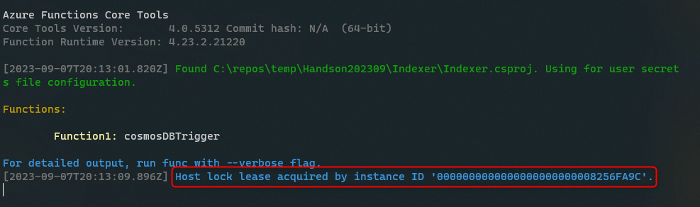

<br>

Cosmos DB でデータが更新されたら、Function App がトリガーされるか試してみましょう。

### Cosmos DB のデータ更新

ここでは Azure portal から Cosmos DB のデータを更新して動作確認をします。

Azure portal で Cosmos DB のリソースを開き、以下の操作をします。

- 左側のメニューから "データ エクスプローラー" をクリック (①) します。
- "handson" データベースの "azure" コンテナー配下の "Items" をクリック (②) します。
- "New Item" をクリック (③) します。
- ④ の部分にデータを登録できます。以下の JSON をペースとして "Save" をクリック (⑤) します。

```json
{
  "id": "1",
  "title": "Azure App Service",
  "content": "Azure App Service is a fully managed platform for building, deploying, and scaling web apps. You can host web apps, mobile app backends, and RESTful APIs. It supports a variety of programming languages and frameworks, such as .NET, Java, Node.js, Python, and PHP. The service offers built-in auto-scaling and load balancing capabilities. It also provides integration with other Azure services, such as Azure DevOps, GitHub, and Bitbucket.",
  "category": "Web"
}
```

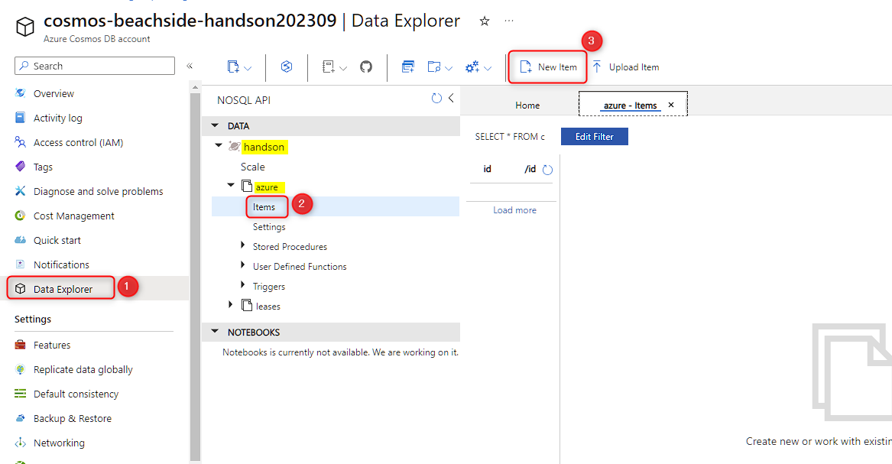

<br>


これで、デバッグしている Function App がトリガーされて、ブレークポイントで止まるはずです。

- `input` にカーソルをあて、入力した json が入っていることを確認できます。
- `F10` キーでステップ実行、または、`F5` キーで処理を最後まで進めます。
- デバッグコンソールに `1 document(s) uploaded.` と表示されたら、Cognitive Search のインデックスの更新が完了しています。

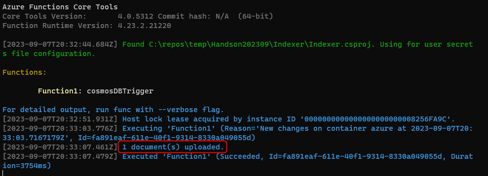

<br>

### Cognitive Search でインデックスの確認

次は、Azure portal で Cognitive Search でインデックスが更新しているかを確認します。

Azure portal で Cognitive Search のリソースを開き、以下の操作をします。

- 左側のメニューから "インデックス" をクリック (①) します。
- "azure" をクリック (②) します。

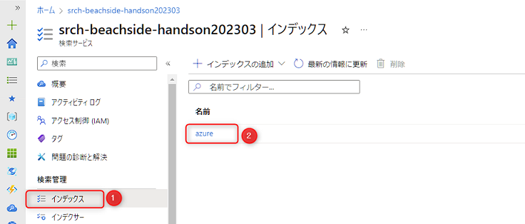

<br>

"検索" をクリックすると全件が検索されます。先ほど登録したデータが表示されます。左上の "ドキュメント" にドキュメント数が表示されますが、ラグで正しく表示されないこともあるため気にしなくて大丈夫です。

ここまで正常にできたら、Visual Studio でデバッグを停止します。

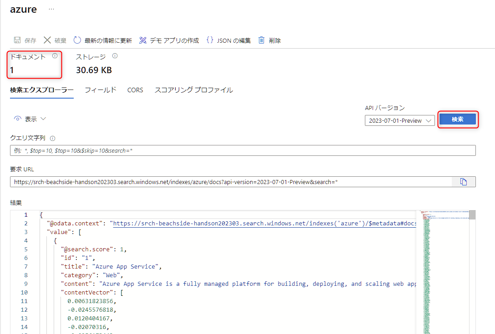

これで、ローカルデバッグで Function App で以下の動作が確認できました。

- Cosmos DB のデータ更新をトリガーにして、Function App が実行されること
- Azure OpenAI を使ってデータをベクター化すること
- Cognitive Search のインデックスが更新される更新すること

## 4-7. Azure へのデプロイ

次は Azure 上の Function App にデプロイして動作確認を行ないます。デプロイは GitHub Actions や Azure DevOps の Pipelines を使って自動化することがベストですが、CI/CD は本質から外れるため、Visual Studio から手動でデプロイをします。

### 発行プロファイルの作成

デプロイするためのプロファイルを作成します。

Visual Studio のソリューションエクスプローラーで "Indexer" プロジェクトを右クリック (①) → "発行" (②) をクリックします。

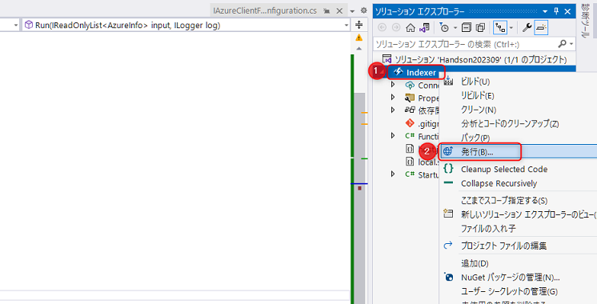

<br>

発行プロファイルの作成ウィザードが起動します。"Azure" をダブルクリックして次へ進みます。

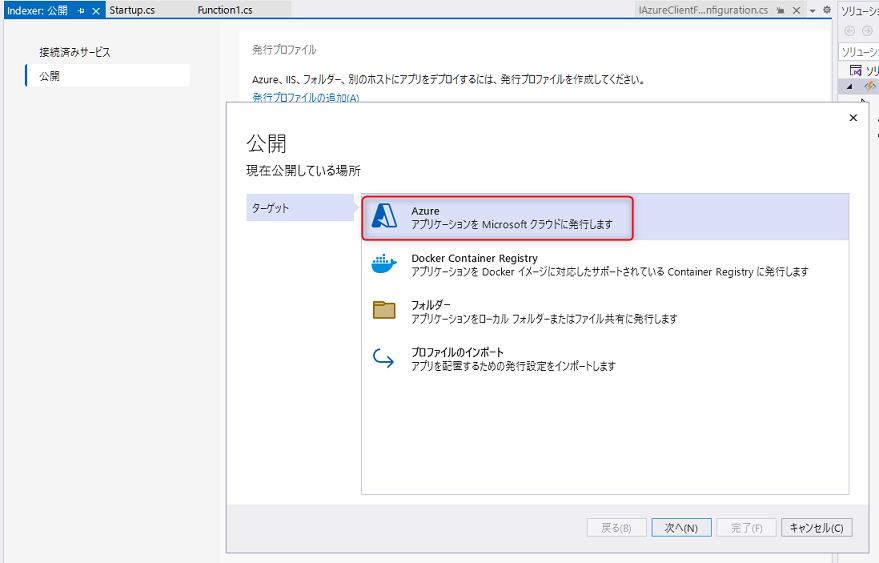

<br>

特定のターゲットでは、"Azure Functions(Windows)" をダブルクリックして次へ進みます。


<br>

Function のインスタンスでは、以下の操作をします。

- ログインしているユーザーが Azure にログインしているユーザーと同じことを確認します (①)。違う場合は正しいアカウントでログインします
- "サブスクリプション名" で今回利用しているサブスクリプションを選択します (②)。選択できない場合、アカウントが異なる可能性がありますので ① を確認します。
- ハンズオンで作成した Change Feed 用の Function App のインスタンスを選択します (③)。
- "パッケージファイルから実行します (推奨)" にチェックを入れます (④)。
- "完了" をクリックします (⑤)。

30秒程度で発行プロファイルの作成は完了します。

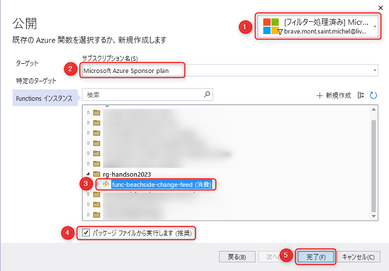

<br>


### Function App の環境変数を更新

ここまで local.setting.json で環境変数を管理してきましたが、Azure にデプロイするときにこの情報は利用されません。そのため、Azure に環境変数を設定します。

Azure portal から設定することも可能ですが、今回は、Visual Studio から設定します。以下図のように "ホスティング" セクションにある ① をクリック → "Azure App Service の設定を管理する" をクリック (②) します。

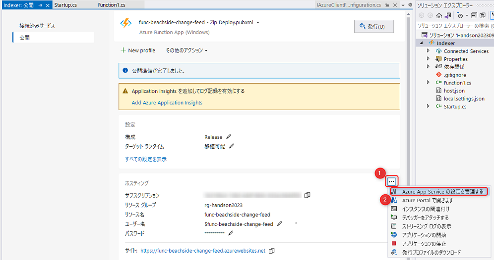

<br>

今回 local.settings.json で設定した以下6つの値をここから登録することが可能です。

- CosmosConnection
- AzureOpenAIOptions:Endpoint
- AzureOpenAIOptions:ApiKey
- CognitiveSearchOptions:Endpoint
- CognitiveSearchOptions:AdminKey
- CognitiveSearchOptions:IndexName

6つの値それぞれで "ローカルから値を挿入する" をクリックすると、Azure 側に登録されます。6つの登録を終えたら OK をクリックします。

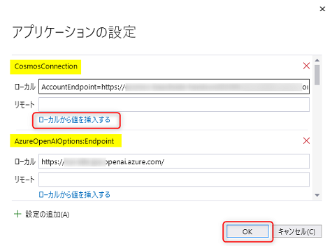

<br>

### デプロイ

"発行" をクリックしてデプロイを開始します。

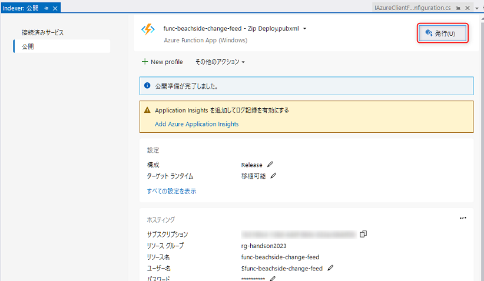

<br>

デプロイが正常に完了すると、以下図のようになります。

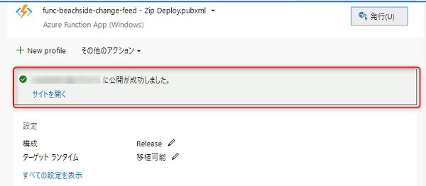

<br>


## 4-8. Azure での動作確認

Azure 上で動作を確認します。

まず最初に、Visual Studio のローカルデバッグが停止していることは再度確認します。ローカルデバッグが動作したままで Azure 上の Function App が動作すると、どちらかのプログラムが Feed のデータを取り合ってしまい、正しく確認ができない場合があるためです。

ここでの Function App の動作確認は、Application Insights のライブメトリックの機能を使ってリアルタイムにモニタリングして確認します。

そのため、Cosmos DB と Cognitive Search を開いているリソースのタブとは別のタブで、Application Insights を開きます。

まず Azure portal で今回作成したリソースグループを開くとリソースの一覧が確認できます。ここから Application Insights のリソースを開きます。

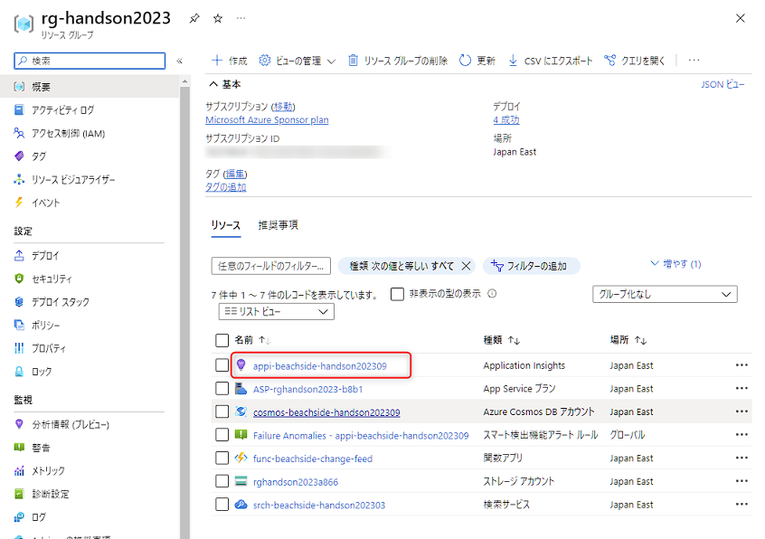

<br>

左側のメニューで "ライブメトリック" をクリックします。この中のサンプルテレメトリにリアルタイムでログが流れてきます。

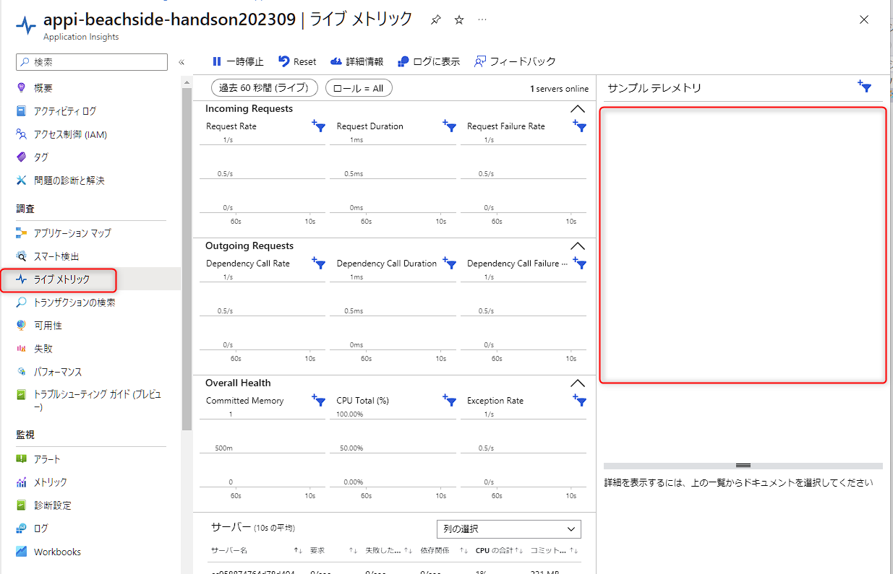

<br>

それでは、Azure portal で Cosmos DB のデータを更新して、Function App が動作するか確認します。

Azure portal で Cosmos DB のリソースを開いているブラウザのタブを開きます。ローカルデバッグ時に Cosmos DB のデータを更新したときと同様に、データエクスプローラー で azure コンテナーの "Items" を開き、"New Item" をクリックします。

サンプルデータの id: 2 のデータ (以下 Json) を登録して "Save" をクリックします。

```json
{
    "id": "2",
    "title": "Azure Functions",
    "content": "Azure Functions is a serverless compute service that enables you to run code on-demand without having to manage infrastructure. It allows you to build and deploy event-driven applications that automatically scale with your workload. Functions support various languages, including C#, F#, Node.js, Python, and Java. It offers a variety of triggers and bindings to integrate with other Azure services and external services. You only pay for the compute time you consume.",
    "category": "Compute"
}
```

後は、以下を確認します。これで Azure 上での動作確認は完了です。

- Application insights のライブメトリックでログが流れるのを確認します。
- Azure portal で Cognitive Search のリソースを開いているブラウザのタブを開き、インデックスが更新されて2件のデータになっていることを確認します。

## ✨ Congratulations ✨

実装の完了おめでとうございます🎉。ここでは以下を実現しました。

- Cosmos DB のデータ更新をトリガーにして、Function App が実行されること
- Azure OpenAI を使ってデータをベクター化すること
- Cognitive Search のインデックスが更新される更新すること
- ローカルデバッグで正常に動作すること
- Azure にデプロイして正常に動作すること

これで、自社独自のデータをイベントドリブンでリアルタイムに Cognitive Serach のインデックスへ反映させる仕組みができました。

次は、Cognitive Search でベクター検索をする処理を実装します。

---

[⏮️ 前へ](./setup-function-app.md) | [📋 目次](../README.md) | [⏭️ 次へ](./implement-vector-search-dotnet.md)
