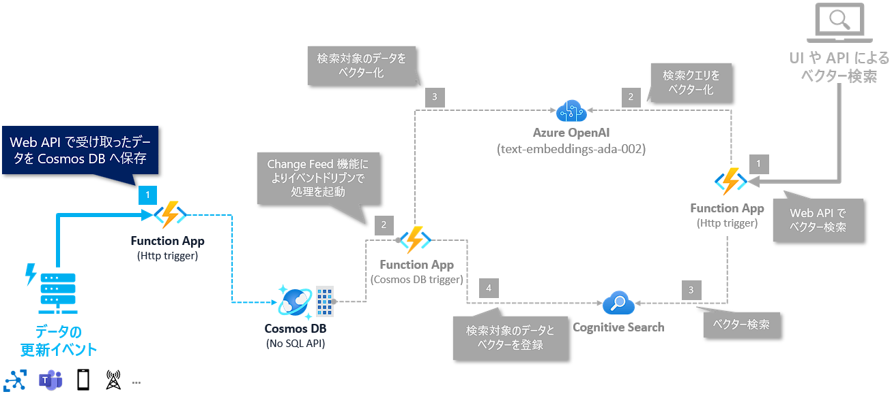
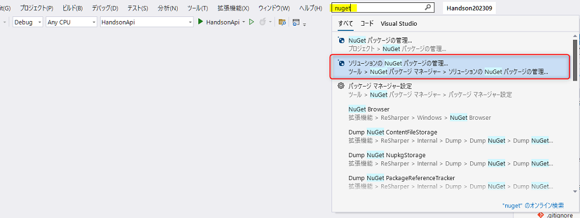
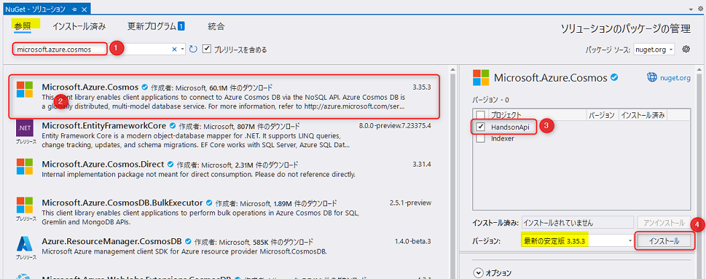
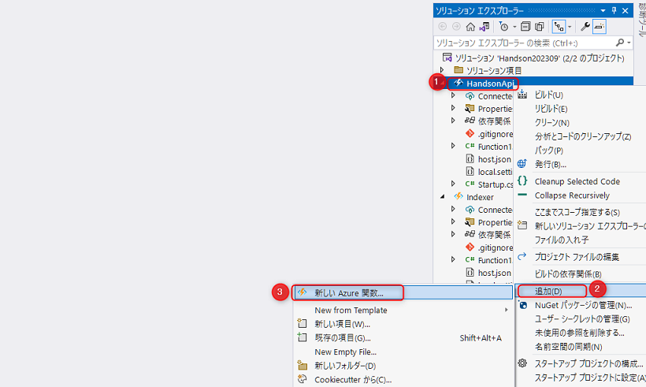
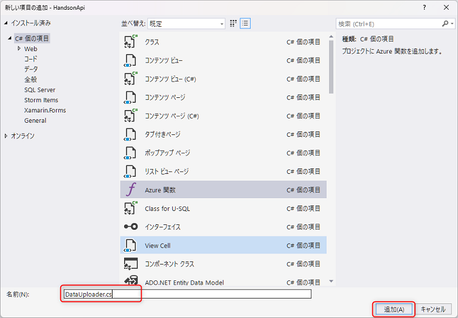
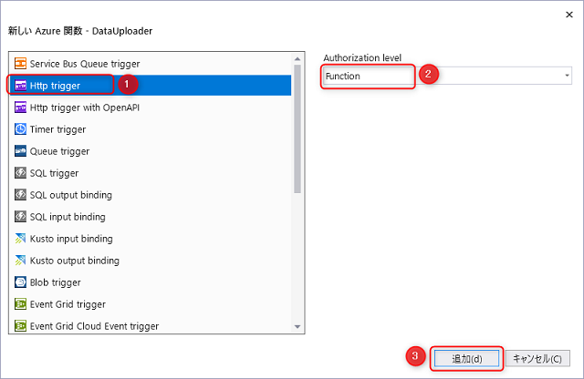

# (オプション) 🧪 6. Cosmos DB のデータ更新

ここでは、アーキテクチャ図のデータ更新 (1) 部分の処理として、以下を実装します。

- Web API (Function App - HTTP trigger) で受け取ったデータ更新を Cosmos DB に保存します (①)。



コンテンツは以下になります。

- 6-1. NuGet パッケージのセットアップ
- 6-2. Dependency Injection (DI) を構成
- 6-3. 機密情報の設定
- 6-4. Cosmos DB のデータ更新処理の実装
- 6-5. ローカルデバッグ
- 6-6. Azure へのデプロイと Azure での動作確認


## 6-1. NuGet パッケージのセットアップ

Cosmos DB にアクセスするための SDK を NuGet パッケージを追加します。

Visual Stuido の上部の検索で「nuget」と入力して "ソリューションの NuGet パッケージの管理" をクリックします。



<br>

以下の手順でパッケージをインストールをします。

- 検索で「microsoft.azure.cosmos」と入力しします (①)
- "Microsoft.Azure.Cosmos" をクリックします (②)。
- "HandsOnApi" にチェックを入れます (③)。
- 最新の安定版 (2023年9月時点だと `v3.35.3`) をインストールします (④)。



<br>

NuGet パッケージのセットアップはこれで完了です。

## 6-2. Dependency Injection (DI) を構成

インストールした NuGet パッケージを使うために、Function App の DI を登録します。

"HandsonApi" の "Startup.cs" を開き、`Configure` メソッド内の下部に以下のコードを追加します。

```csharp
        // CosmosClient の登録
        builder.Services.AddSingleton(_ =>
        {
            var connectionString = Environment.GetEnvironmentVariable("CosmosConnection") ?? throw new NullReferenceException("CosmosConnection");
            var options = new CosmosClientOptions
            {
                SerializerOptions = new CosmosSerializationOptions { PropertyNamingPolicy = CosmosPropertyNamingPolicy.CamelCase }
            };
            return new CosmosClient(connectionString, options);
        });
```

## 6-3. 機密情報の設定

DI の登録時、`CosmosConnectionString` という環境変数で Cosmod DB の接続文字列を取得しました。その設定を local.settings.json に追加します。

### local.settings.json の編集

"HantsonApi" の "local.settings.json" を開き、以下のように `"CosmosConnectionString":""` を追加します。

```json
{
  "IsEncrypted": false,
  "Values": {
    "AzureWebJobsStorage": "UseDevelopmentStorage=true",
    "FUNCTIONS_WORKER_RUNTIME": "dotnet",
    "AzureOpenAIOptions:Endpoint": "xxx",
    "AzureOpenAIOptions:ApiKey": "xxx",
    "CognitiveSearchOptions:Endpoint": "xxx",
    "CognitiveSearchOptions:QueryKey": "xxx",
    "CognitiveSearchOptions:IndexName": "azure",
    "CosmosConnection": "",

  }
}
```

### 値をセット

Cosmos DB の接続文字列は、"Indexer" の Function App の "local.settings.json" ですでに登録済みなので、そちらから値を取得し、"HantsonApi" の "local.settings.json" `CosmosConnection` の値へペースとします。


## 6-4. Cosmos DB のデータ更新処理の実装

"HandsonApi" の Function App に Function を追加して実装を進めていきます。


### Function App へ Function の追加

ここでは、Vector search に利用した Function App に、Cosmos DB のデータを更新するための Function を追加します。Visual Studio のソリューションエクスプローラーから "HandsonApi" を右クリック (①) → "追加" をクリック (②) → "新しい Azure 関数" をクリック (③) を選択します。



<br>

名前に「CosmosDataUploaderc.cs」と入力し "追加" をクリックします。



<br>


トリガーは "Http trigger" を選択し (①) 、Authorization level は "Anonymous" を選択 (②) して "追加" をクリック (③)します。



<br>

### Function の実装


実装の流れは以下です。

- コンストラクターインジェクションで `CosmosClient` の値を取得します。
- API の HTTP method は "POST"で構成しています。
- リクエストボディで値から登録するデータを配列で取得します。
  - 入力値のバリデーションは省略しています。
- Cosmos DB へ Upsert します。
  - API で受け取るデータのサイズが大きくなるユースケースの場合は、Bulk での更新も検討します。
  - 参考: <https://learn.microsoft.com/ja-jp/azure/cosmos-db/nosql/how-to-migrate-from-bulk-executor-library>

コードは以下となります。

```csharp
using Microsoft.AspNetCore.Mvc;
using Microsoft.Azure.Cosmos;
using Microsoft.Azure.WebJobs;
using Microsoft.Azure.WebJobs.Extensions.Http;
using Microsoft.Extensions.Logging;
using System.Linq;
using System.Threading.Tasks;

namespace HandsonApi;

public class DataUploader
{
    private const string DatabaseId = "handson";
    private const string ContainerId = "azure";

    private readonly CosmosClient _cosmosClient;

    public DataUploader(CosmosClient cosmosClient)
    {
        _cosmosClient = cosmosClient;
    }

    [FunctionName("upload")]
    public async Task<IActionResult> Run(
        [HttpTrigger(AuthorizationLevel.Function, "post", Route = "cosmos/upload"), FromBody] AzureInfo[] items,
        ILogger log)
    {
        var container = _cosmosClient.GetContainer(DatabaseId, ContainerId);

        // Cosmos DB へ Upsert
        var tasks = items.Select(item => container.UpsertItemAsync(item, new PartitionKey(item.Id))).ToArray();
        await Task.WhenAll(tasks);

        return new OkResult();
    }
}

public record AzureInfo(string Id, string Category, string Title, string Content);
```

## 6-5. ローカルデバッグ

"HandsonApi" をローカルデバッグして動作確認をしましょう。デバッグを実行後、この API に対して POST で、リクエストボディには以下のようなフォーマットでデータをセットすると、登録処理が正常に行なわれます。

API が正常に動作して Cosmos DB への Upsert 処理が行なわれると、"Indexer" の Function App がトリガーして Cognitive Search のインデックスが更新されます。

```json
[
    {
        "id": "3",
        "title": "Azure Cognitive Services",
        "content": "Azure Cognitive Services are a set of AI services that enable you to build intelligent applications with powerful algorithms using just a few lines of code. These services cover a wide range of capabilities, including vision, speech, language, knowledge, and search. They are designed to be easy to use and integrate into your applications. Cognitive Services are fully managed, scalable, and continuously improved by Microsoft. It allows developers to create AI-powered solutions without deep expertise in machine learning.",
        "category": "AI + Machine Learning"
    },
    {
        "id": "4",
        "title": "Azure Storage",
        "content": "Azure Storage is a scalable, durable, and highly available cloud storage service that supports a variety of data types, including blobs, files, queues, and tables. It provides a massively scalable object store for unstructured data. Storage supports data redundancy and geo-replication, ensuring high durability and availability. It offers a variety of data access and management options, including REST APIs, SDKs, and Azure Portal. You can secure your data using encryption at rest and in transit.",
        "category": "Storage"
    },
    {
        "id": "5",
        "title": "Azure SQL Database",
        "content": "Azure SQL Database is a fully managed relational database service based on the latest stable version of Microsoft SQL Server. It offers built-in intelligence that learns your application patterns and adapts to maximize performance, reliability, and data protection. SQL Database supports elastic scaling, allowing you to dynamically adjust resources to match your workload. It provides advanced security features, such as encryption, auditing, and threat detection. You can migrate your existing SQL Server databases to Azure SQL Database with minimal downtime.",
        "category": "Databases"
    }
]
```


## 6-6. Azure へのデプロイと Azure での動作確認

ローカルデバッグで正常に動作することが確認できたら、Azure へデプロイして動作確認を行ないます。

- 発行プロファイルは作成済みのため、ソリューションエクスプローラーで "HandsonApi" を右クリック → "発行" をクリックして、"発行ボタンをクリックしてデプロイが可能です。
- Azure へデプロイして動作確認をしましょう。


## ✨ Congratulations ✨

おめでとうございます🎉。ここでは、Cosmos DB へのデータ登録の API の実装を行ないました。

これで Cosmos DB へのデータ登録から Cognitive Search のインデックスの更新までの一連の流れが実装できました。

---

[⏮️ 前へ](./implement-vector-search-dotnet.md) | [📋 目次](../README.md) | [⏭️ リソースの削除へ](./remove-azure-resources.md)

