# 🧪 5. ベクター検索の実装 (C#)

ここでは、アーキテクチャ図のベクター検索 (1～3) 部分の処理として、以下を実装します。

- Http trigger の Function App でリクエストを受け取る (①)
- Functio App で以下の処理を行ないます。
  - 検索クエリのベクター化を行なう (②)
  - Cognitive Search でベクター検索を行ない、結果を返す (③)。

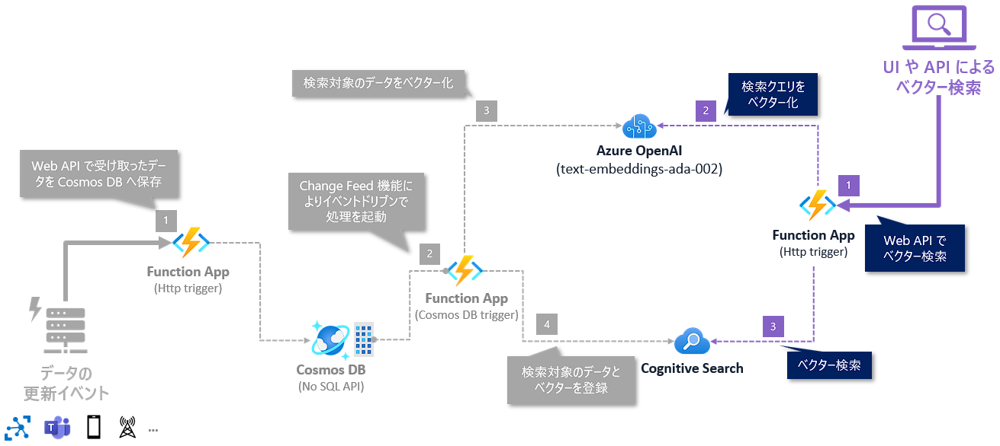

コンテンツは以下になります。

- 5-1. Function App プロジェクトの追加
- 5-2. NuGet パッケージのセットアップ
- 5-3. Dependency Injection (DI) を構成
- 5-4. 機密情報の設定
- 5-5. ベクター検索の実装
- 5-6. ローカルデバッグ
- 5-7. Azure へのデプロイ
- 5-8. Azure での動作確認


## 5-1. Function App プロジェクトの追加

Web API 用に Function App のプロジェクトを追加します。

Visual Studio のソリューションエクスプローラーでソリューションを右クリック (①) → "追加" をクリック (②) → "新しいプロジェクト" をクリック (③) します。

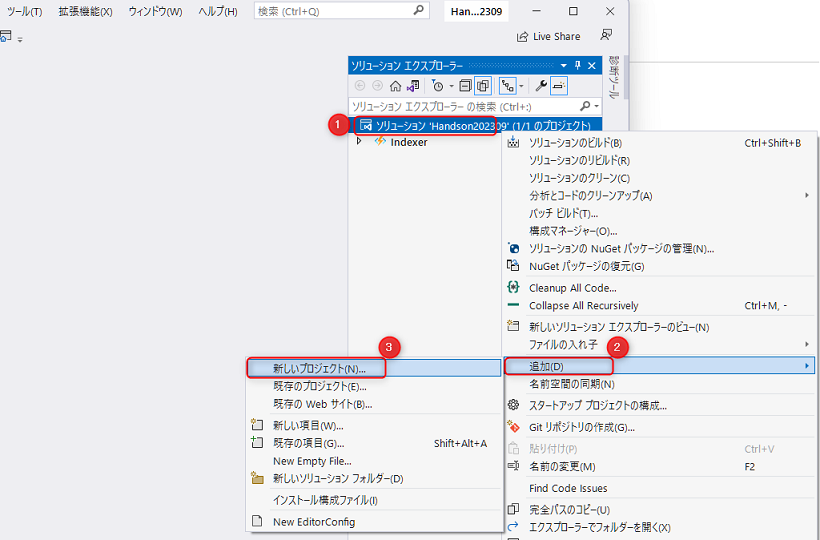

<br>


最近使用したプロジェクトテンプレートで Azure Functions が出ていると思いますので、"Azure Functions" をダブルクリックして次へ進みます。

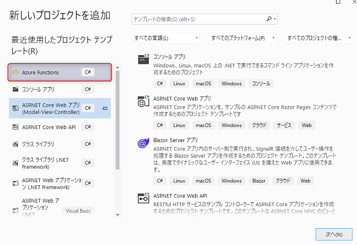

<br>

プロジェクトの構成が表示されます。"プロジェクト名" に「HandsonApi」と入力して "次へ" をクリックします。

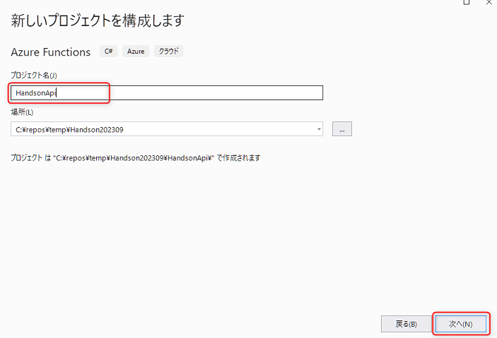

<br>


追加情報が表示されます。以下を参考に入力し、"作成" をクリックすると、プロジェクトが作成されます。

No. | 項目 | 入力内容
---: | --- | ---
1 | Functions worker | ".NET6.0 (長期的なサポート)" を選択します。
2 | Function | "Http Trigger" を選択します。その下のチェックは下図を参考にします。
3 | Authorization level | "Function" を選択します。

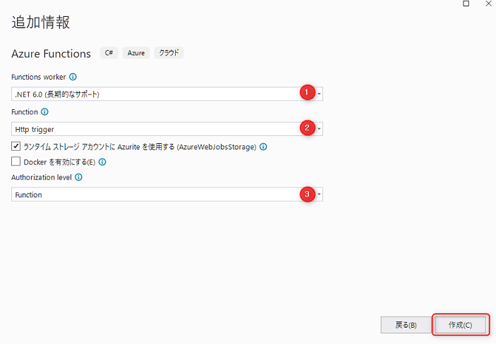

<br>

## 5-2. NuGet パッケージのセットアップ

従来は、ソリューションで複数のプロジェクトを扱う場合、NuGet パッケージの参照をプロジェクトごとに行う必要があったためバージョンの管理の手間がかかりました。これに対して2022年にプロジェクト間のバージョン管理を一元化する機能として [Central Package Management](https://learn.microsoft.com/ja-jp/nuget/consume-packages/central-package-management) ができました。

今回はこの機能を適用して、プロジェクト間の NuGet パッケージのバージョンを一元管理します。

### Central Package Management でNuGet のバージョンを一元管理

ソリューションエクスプローラーでソリューションを右クリック (①) → "追加 " をクリック (②) → "新しい項目" をクリック (③) します。

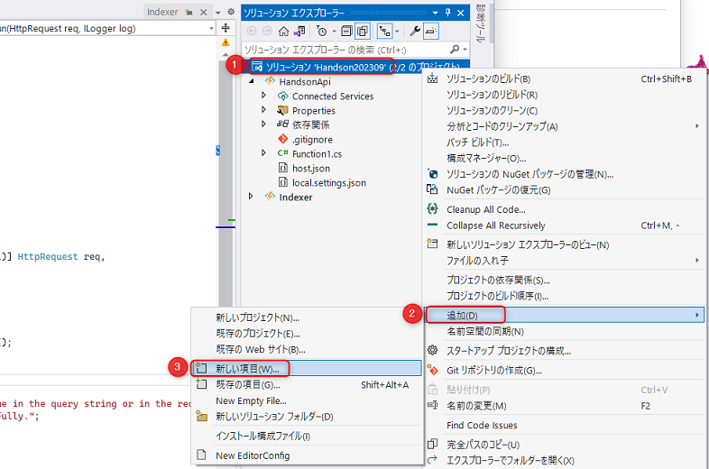

<br>

"XML ファイル" をクリックして、"名前" に「Directory.Packages.props」と入力して "追加" をクリックします。

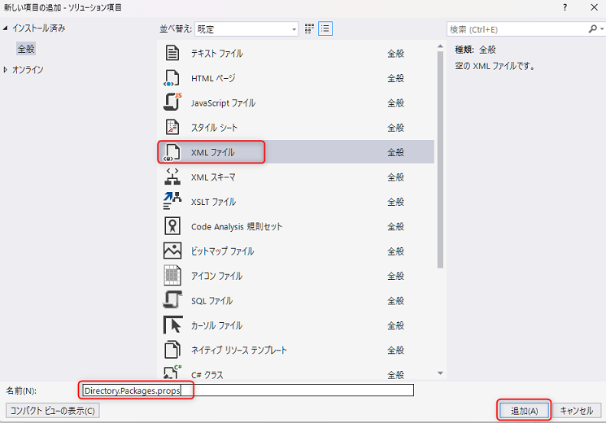

<br>

"Directory.Packages.props" が、ソリューションの直下の "ソリューション項目" の中に追加されたことを確認します。

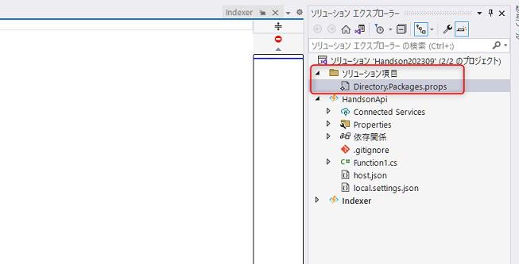

<br>

ソリューションエクスプローラーから "Directory.Packages.props" を開き以下のように入力します。これでこのファイルでバージョンを一元管理するようになります。

```xml
<Project>
  <PropertyGroup>
    <ManagePackageVersionsCentrally>true</ManagePackageVersionsCentrally>
  </PropertyGroup>
  <ItemGroup>
    <PackageVersion Include="Azure.AI.OpenAI" Version="1.0.0-beta.7" />
    <PackageVersion Include="Azure.Identity" Version="1.10.0" />
    <PackageVersion Include="Azure.Search.Documents" Version="11.5.0-beta.4" />
    <PackageVersion Include="Microsoft.Azure.Cosmos" Version="3.35.3" />
    <PackageVersion Include="Microsoft.Azure.Functions.Extensions" Version="1.1.0" />
    <PackageVersion Include="Microsoft.Extensions.DependencyInjection" Version="6.0.1" />
    <PackageVersion Include="Microsoft.NET.Sdk.Functions" Version="4.2.0" />
    <PackageVersion Include="Microsoft.Azure.WebJobs.Extensions.CosmosDB" Version="4.3.1" />
  </ItemGroup>
</Project>
```

次に、"Indexer" の csproj ファイルを更新します。ソリューションエクスプローラーで "Indexer" プロジェクトをクリックして "Indexer" の csproj ファイルを開きます。

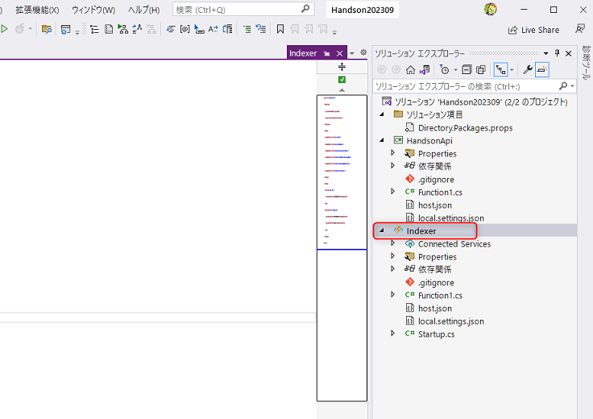

`PackageReference` にあるバージョン情報を削除し、以下のように変更します。これで、`Directory.Packages.props` で一元管理されたバージョンが参照されるようになります。

```xml
<Project Sdk="Microsoft.NET.Sdk">
  <PropertyGroup>
    <TargetFramework>net6.0</TargetFramework>
    <AzureFunctionsVersion>v4</AzureFunctionsVersion>
  </PropertyGroup>
  <ItemGroup>
    <PackageReference Include="Azure.AI.OpenAI" />
    <PackageReference Include="Azure.Search.Documents" />
    <PackageReference Include="Microsoft.Azure.Functions.Extensions" />
    <PackageReference Include="Microsoft.Azure.WebJobs.Extensions.CosmosDB" />
    <PackageReference Include="Microsoft.Extensions.DependencyInjection"  />
    <PackageReference Include="Microsoft.NET.Sdk.Functions" />
  </ItemGroup>
  <ItemGroup>
    <None Update="host.json">
      <CopyToOutputDirectory>PreserveNewest</CopyToOutputDirectory>
    </None>
    <None Update="local.settings.json">
      <CopyToOutputDirectory>PreserveNewest</CopyToOutputDirectory>
      <CopyToPublishDirectory>Never</CopyToPublishDirectory>
    </None>
  </ItemGroup>
</Project>
```

次に "HandsonApi" のプロジェクトをクリックして csproj ファイルを開き、以下のように `ItemGroup` に必要なパッケージを追加します。

```xml
<Project Sdk="Microsoft.NET.Sdk">
  <PropertyGroup>
    <TargetFramework>net6.0</TargetFramework>
    <AzureFunctionsVersion>v4</AzureFunctionsVersion>
  </PropertyGroup>
  <ItemGroup>
   <PackageReference Include="Azure.AI.OpenAI" />
   <PackageReference Include="Azure.Search.Documents" />
   <PackageReference Include="Microsoft.Azure.Functions.Extensions" />
   <PackageReference Include="Microsoft.Extensions.DependencyInjection"  />
   <PackageReference Include="Microsoft.NET.Sdk.Functions" />
  </ItemGroup>
  <ItemGroup>
    <None Update="host.json">
      <CopyToOutputDirectory>PreserveNewest</CopyToOutputDirectory>
    </None>
    <None Update="local.settings.json">
      <CopyToOutputDirectory>PreserveNewest</CopyToOutputDirectory>
      <CopyToPublishDirectory>Never</CopyToPublishDirectory>
    </None>
  </ItemGroup>
</Project>
```

## 5-3. Dependency Injection (DI) を構成

ここでは、Cognitive Search でベクター検索をするために以下2つの class を登録します。

- `OpenAIClient` (`Azure.AI.OpenAI` namespace) を Singleton で登録
- `SearchClient` (`Azure.Search.Documents` namespace) を Singleton で登録

ソリューションエクスプローラーで Function App ("HandsonApi") を右クリック (①) → "追加" (②) をクリック→ "クラス" (③) をクリックします。

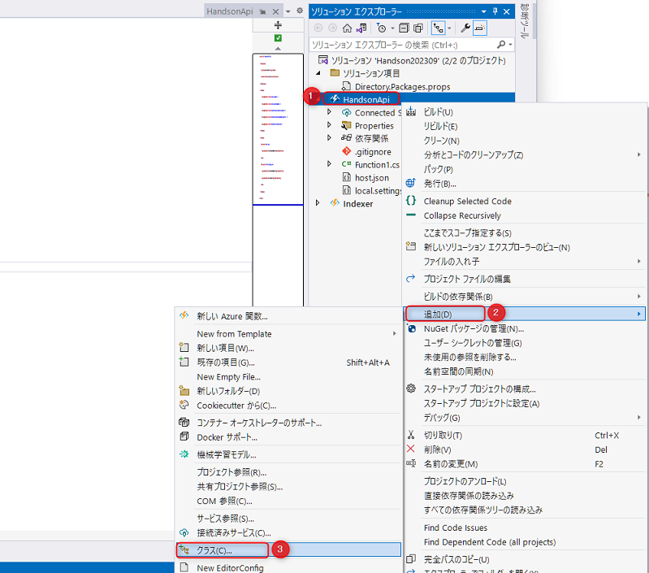

<br>

名前は「Startup.cs」と入力し、"追加" をクリックすると、ファイルが作成されます。

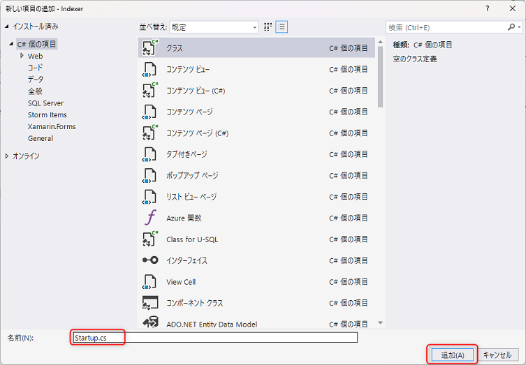

<br>


Startup.cs の実装は以下のようにします。

```csharp
using Azure;
using Azure.AI.OpenAI;
using Azure.Core.Serialization;
using Azure.Search.Documents;
using Microsoft.Azure.Functions.Extensions.DependencyInjection;
using Microsoft.Extensions.DependencyInjection;
using System;
using System.Text.Json;

[assembly: FunctionsStartup(typeof(HandsonApi.Startup))]

namespace HandsonApi;

internal class Startup : FunctionsStartup
{
    public override void Configure(IFunctionsHostBuilder builder)
    {
        // OpenAIClient を登録
        builder.Services.AddSingleton(_ =>
        {
            var endpoint = new Uri(Environment.GetEnvironmentVariable("AzureOpenAIOptions:Endpoint") ?? throw new NullReferenceException("AzureOpenAIOptions:Endpoint"));
            var apiKey = Environment.GetEnvironmentVariable("AzureOpenAIOptions:ApiKey") ?? throw new NullReferenceException("AzureOpenAIOptions:ApiKey");

            return new OpenAIClient(endpoint, new AzureKeyCredential(apiKey));
        });

        // SearchClient を登録
        builder.Services.AddSingleton(_ =>
        {
            var endpoint = new Uri(Environment.GetEnvironmentVariable("CognitiveSearchOptions:Endpoint") ?? throw new NullReferenceException("CognitiveSearchOptions:Endpoint"));
            var queryKey = Environment.GetEnvironmentVariable("CognitiveSearchOptions:queryKey") ?? throw new NullReferenceException("CognitiveSearchOptions:queryKey");
            var indexName = Environment.GetEnvironmentVariable("CognitiveSearchOptions:IndexName") ?? throw new NullReferenceException("CognitiveSearchOptions:IndexName");

            var jsonSerializerOptions = new JsonSerializerOptions { PropertyNamingPolicy = JsonNamingPolicy.CamelCase };
            // C# の class (pascal-case) と CognitiveSearch index schema (camel-case) を補完するためのオプション
            var searchClientOptions = new SearchClientOptions { Serializer = new JsonObjectSerializer(jsonSerializerOptions) };

            return new SearchClient(endpoint, indexName, new AzureKeyCredential(queryKey), searchClientOptions);
        });
    }
}
```

これで DI の設定は完了です。

## 5-4. 機密情報の設定

前節 Indexer の実装で設定したのと同様で、機密情報の管理は、デフォルトでソースコードのバージョン管理外になっている local.settings.json で管理します。

json は以下のようにします。

```json
{
  "IsEncrypted": false,
  "Values": {
    "AzureWebJobsStorage": "UseDevelopmentStorage=true",
    "FUNCTIONS_WORKER_RUNTIME": "dotnet",
    "AzureOpenAIOptions:Endpoint": "",
    "AzureOpenAIOptions:ApiKey": "",
    "CognitiveSearchOptions:Endpoint": "",
    "CognitiveSearchOptions:QueryKey": "",
    "CognitiveSearchOptions:IndexName": "azure"
  }
}
```

次にそれぞれの値をセットします。

### Azure OpenAI Service の情報

`AzureOpenAIOptions:Endpoint` と `AzureOpenAIOptions:ApiKey` は Indexer の Function App と同じ値を使いますので、Indexer の local.settings.json から値をコピーしてペーストします。

### Cognitive Search の情報

前節の Indexer の実装ではインデックスの更新処理があるため Cognitive Search のキーに Admin Key を使いました。ここではインデックスを読むだけのため、読み取り専用である Query Key を使います。

Azure portal の Cognitive Search のリソースの左側のメニューから "キー" をクリック (①)して、クエリキーの管理にあるキーの値をコピー (②) して、local.settings.json の `CognitiveSearchOptions:QueryKey` の値にペーストします。

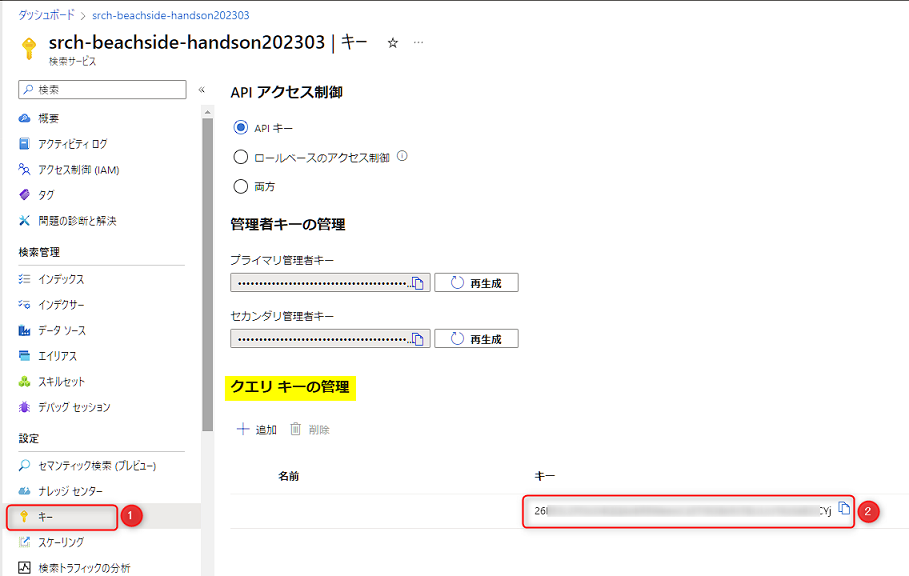

`CognitiveSearchOptions:Endpoint` は、Indexer の Function App と同じ値をペーストします。

## 5.5. ベクター検索の実装

ここでは、クエリ文字列に含まれる `query` の値を使ってベクター検索を行う Web API を実装します。処理の流れは以下です。

- class の最初で、変数 `EmbeddingsDeploymentName` に Azure OpenAI の "text-embedding-ada-002" をデプロイしたときの Deployment Name を設定します。
  - ここでは、チャプター1で指定した "text-embedding-ada-002" を設定しています。
- コンストラクターインジェクションで `OpenAIClient` と `SearchClient` のインスタンスを取得。
- リクエストのクエリ文字列に含まれる `query` の値を取得。
- Azure OpenAI Service を使って `query` の値をベクター化。
- ベクター化した値を使って Cognitive Search でベクター検索し、結果を返す。
  - 検索結果を格納する型として、`SearchResult` class を同一ファイル内に定義しています。

コードは以下となります。

```csharp
using Azure.AI.OpenAI;
using Azure.Search.Documents;
using Azure.Search.Documents.Models;
using Microsoft.AspNetCore.Http;
using Microsoft.AspNetCore.Mvc;
using Microsoft.Azure.WebJobs;
using Microsoft.Azure.WebJobs.Extensions.Http;
using Microsoft.Extensions.Logging;
using System.Collections.Generic;
using System.Linq;
using System.Threading.Tasks;

namespace HandsonApi;

public class Function1
{
    private static readonly string EmbeddingsDeploymentName = "text-embedding-ada-002";
    private static readonly string VectorField = "contentVector";
    private static readonly int DataCount = 3;

    private readonly OpenAIClient _openAIClient;
    private readonly SearchClient _searchClient;

    public Function1(OpenAIClient openAIClient, SearchClient searchClient)
    {
        _openAIClient = openAIClient;
        _searchClient = searchClient;
    }

    [FunctionName("vector-search")]
    public async Task<IActionResult> Run(
        [HttpTrigger(AuthorizationLevel.Function, "get", Route = null)] HttpRequest req,
        ILogger log)
    {
        // クエリ文字列で `query` の値を取得
        var query = req.Query["query"];

        if (string.IsNullOrWhiteSpace(query))
        {
            return new BadRequestResult();
        }

        // ベクター化
        var embedding = await GetEmbeddingAsync(query);
        // ベクター検索の実行
        var searchResults = await ExecuteVectorSearchAsync(embedding);

        if (searchResults.Any())
        {
            return new OkObjectResult(searchResults);
        }

        return new NotFoundResult();
    }

    private async Task<IReadOnlyList<float>> GetEmbeddingAsync(string text)
    {
        var response = await _openAIClient.GetEmbeddingsAsync(EmbeddingsDeploymentName, new EmbeddingsOptions(text));
        return response.Value.Data[0].Embedding;
    }

    private async Task<List<IndexDocument>> ExecuteVectorSearchAsync(IReadOnlyList<float> embedding)
    {
        var searchOptions = new SearchOptions
        {
            Vectors = { new SearchQueryVector { Value = embedding.ToArray(), KNearestNeighborsCount = 3, Fields = { VectorField } } },
            Size = DataCount,
            Select = { "title", "content", "category" }
        };

        // `Azure.Search.Documents.Models.SearchDocument` を `SearchAsync()` の Generics に定義してコールしているが、
        // 独自の class を Generics として定義も可能。
        SearchResults<SearchDocument> response = await _searchClient.SearchAsync<SearchDocument>(null, searchOptions);
        var searchResults = new List<IndexDocument>(DataCount);
        await foreach (var result in response.GetResultsAsync())
        {
            searchResults.Add(new IndexDocument
            {
                Title = result.Document["title"].ToString(),
                Category = result.Document["category"].ToString(),
                Content = result.Document["content"].ToString(),
                Score = result.Score
            });
        }

        return searchResults;
    }
}

/// <summary>
/// 検索結果のモデル
/// </summary>
/// <remarks>検索結果の API の response body には List で出力</remarks>>
public class IndexDocument
{
    public string Title { get; set; }
    public string Category { get; set; }
    public string Content { get; set; }
    public double? Score { get; set; }
}
```

これで実装は完了です。

## 5-6. ローカルデバッグ

ローカルデバッグで動作確認をします。38行目あたりにブレークポイントを設定します。

デバッグは、Visual Studio の上部で "HandsonApi" に切り替えて、`F5` キーを押してデバッグを開始します。  

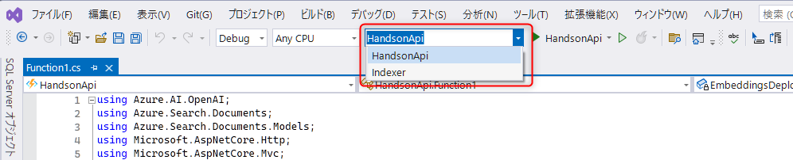

<br>

コンソールでエラーがないことを確認し、ブラウザーや Postman、または VS Code の拡張機能などで、クエリ文字列 "query" に適当な値を入力してデバッグ実行している API をコールします。

デバッグコンソールで URL に `http://localhost:7071/api/vector-search` と表示されている場合は、以下のように API をコールします。

- `http://localhost:7071/api/vector-search?query=azure`

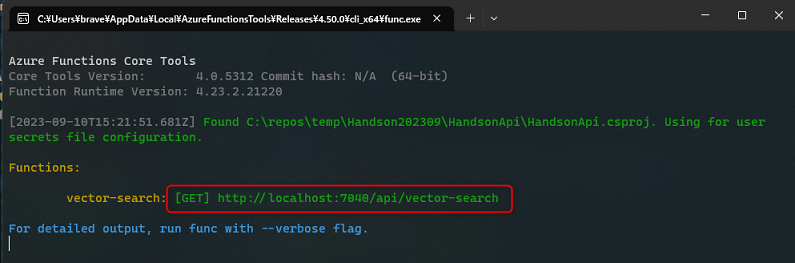

<br>

Function App 起動時や API コール時にデバッグコンソールで起きている場合は、エラーに応じた対処をしましょう。

正常に API がコールされ、検索結果を取得できれば実装完了です。

## 5-7. Azure へのデプロイ

前節「4-7. Azure へのデプロイ」で行なった手順と同様で、2つめの Function App (API 用) に以下の操作を行ないます。

- Function App の発行プロファイルの作成
- Function App の環境変数を更新
- デプロイ

手順が不明の場合は、前節「4-7. Azure へのデプロイ」をご確認ください。

## 5-8 Azure での動作確認

Azure 上の Funciton App で動作確認をします。

まず、API の URL を取得するために Azure portal で該当の Function App のリソースを開きます。左メニューの概要 (①) で "関数" の一覧から `vector-search` をクリック (②)します (表示されない場合は、Visual Studio でデプロイが正常に終わっていることを再確認し、しばらく待ってから Azure portal の画面をリフレッシュをして表示されるのを待ちます) 。

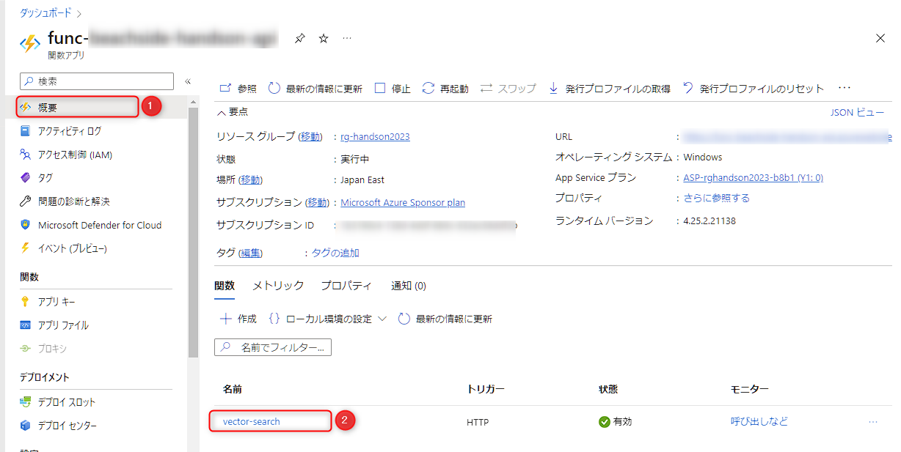

<br>

この Function の URL は、"コードとテスト" (①) をクリック → 上部の "関数の URL の取得" をクリック (②) → "URL をコピーして確認可能です。Function の認証レベルが "Function" のためクエリ文字列には API キーとして `code` が付与されています。

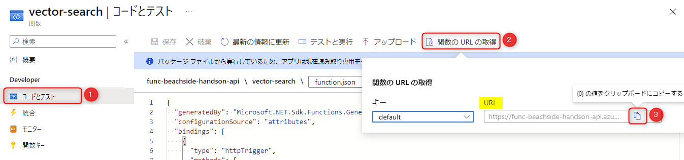

<br>

取得した URL にクエリ文字列 "query" に適当な値をセットして API をコールし、動作を確認しましょう。Application Insights のライブメトリックからリアルタイムに動作を確認することも可能です。


## ✨ Congratulations ✨

おめでとうございます🎉。ここでは、Azure OnepAI Service と Cognitive Search を使ってベクター検索を実現できました。

次は、オプションのコンテンツとして Cosmos DB のデータ更新を実装します。

※ ここでハンズオン終了する場合、リソースの削除の判断は、自己責任でお願いいたします。

---

[⏮️ 前へ](./implement-change-feed-dotnet.md) | [📋 目次](../README.md) | [⏭️ 次へ](./implement-cosmos-data-update-dotnet.md)
