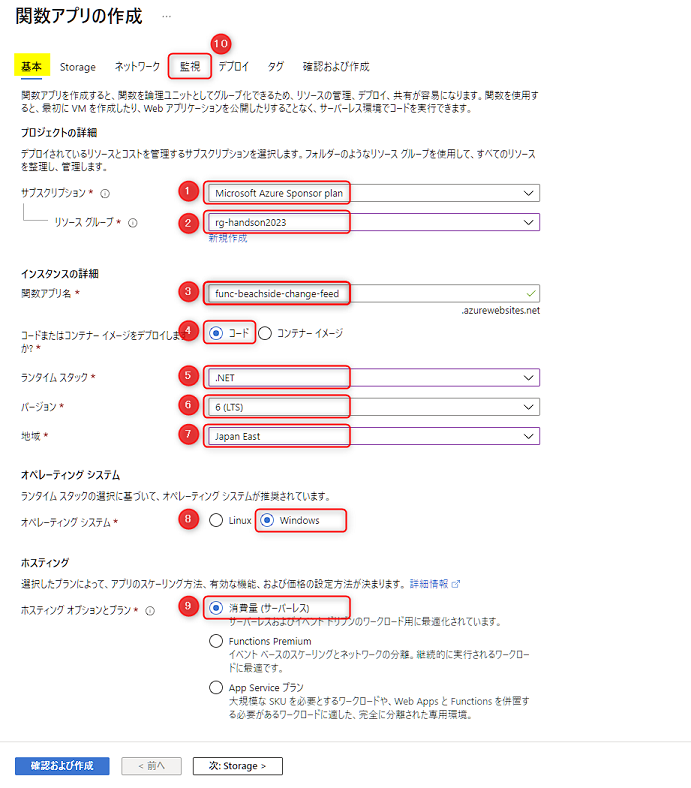
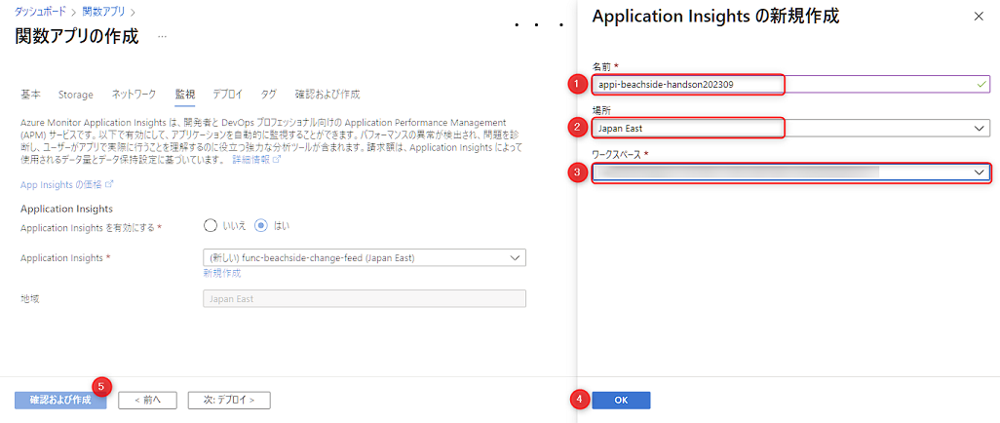

# 🧪 3. Functiohn App のセットアップ

Function App (関数アプリ) は多様なトリガーからイベントドリブンで処理を実行することのできる PaaS/Serverless のサービスです。Http リクエストをトリガーとした REST API や、Azure の Blob Storage にファイルがアップロードされたことをトリガーとした処理などが容易に実装できます。

こでは、Function App で以下を実践します。

- 3-1. Function App のリソース作成 (Change Feed 用)
- 3-2. Function App のリソース作成 (API 用)

## 3-1. Function App のリソース作成 (Change Feed 用)

Azure portal から Function App のリソースを作成します。  
先ほど開いた Cosmos DB のタブとは別のタブで Azure portal (`portal.azure.com`) を開き、上部の検索で「関数」と入力して表示される "関数アプリ" をクリックします。

 

Function App の一覧が表示されますので、上部にある "作成" をクリックします。

 

Function App の作成画面で "基本" タブが表示されます。以下を参考に入力したら、次は上部にある "監視" タブ (⑩) をクリックします。

 No. | 項目 | 入力内容
---: | --- | ---
1 | サブスクリプション | 任意のサブスクリプションを選択します。
2 | リソースグループ | このハンズオンで作成したリソースグループを選択します。
3 | 関数アプリ名 | 任意の名称を入力します。これはグローバルで一意の名称になる必要があります。例:「func-xxxx-change-feed」( "xxx" は自分のハンドルネームや任意のプロジェクト名など) 。
4 | コードまたはコンテナーイメージをデプロイしますか? | "コード" を選択します。
5 | ランタイムスタック | ".NET" を選択します。
6 | バージョン | "6 (LTS)" を選択します。
7 | 地域 | Cognitive Search と同じ場所を選択します。
8 | オペレーティングシステム | "Windows" を選択します。
9 | プランの種類 | "消費量 (サーバーレス)" を選択します。

 

"監視" タブでは、Application Insights の作成をします。有効にするで "はい" を選択し、Application Insights の選択で "新規作成" をクリックします。以下を参考に入力したら、"OK" (④)をクリックします。最後に "確認および作成" (⑤) をクリックします。

 No. | 項目 | 入力内容
---: | --- | ---
1 | 場所 | 任意の名称を入力します。これはグローバルで一意の名称になる必要があります。例:appi-xxxx-handson」( "xxx" は自分のハンドルネームやプロジェクト名など) 。
2 | 名前 | Function App と同じ場所を選択します。
3 | ワークスペース | Function App と同じ場所にあるワークスペースを選択します。なければ "Log Analytics ワークスペース" を新規に作成します。

 

検証に問題がなければ、下部にある "作成" をクリックします。2分程度で完成します。

 

## 3-2. Function App のリソース作成 (API 用)

Function App をもう1つ作成します。

作成方法は先述同様ですが、以下を参考にします。

- (基本タブ) 関数アプリ名: 例として「func-xxxx-api」( "xxx" は自分のハンドルネームや任意のプロジェクト名など) にします。
- (監視タブ) Application Insights: 先ほど作成したものを選択します。

## ✨ Congratulations ✨

おめでとうございます🎉。これで Function App のセットアップは完了です。  

次は、Congnitive Search のインデックスを更新する Function App を実装します。

---

[⏮️ 前へ](./setup-cosmos-db.md) | [📋 目次](../README.md) | [⏭️ 次へ](./implement-change-feed-dotnet.md)
